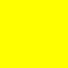

# BMP Image Generation and Fractals in C++

This project is a demonstration of BMP image generation from scratch in C++. In addition, it explores the creation of fractals using this image generation capability.

## Prerequisites

- CMake 3.26 or higher
- C++17 compiler
- Debug build type

## Build and Run

To build the project, use the following commands:

```cpp
mkdir build
cd build
cmake ..
make
```

To execute the program, run:

```zsh
./bmp_fractal
```

## What I Learned

Working on this project has been a valuable learning experience. Here are some key takeaways:

1. **Image Generation**: I gained insights into generating BMP images from scratch, understanding the file format, and manipulating pixel data.

2. **Fractals**: I explored fractal generation techniques, which allowed me to create stunning visual patterns.

3. **Struct Padding and Packing**: Dealing with BMP file structures helped me understand struct padding and packing, ensuring data alignment.

4. **Clean and Concise Code**: Writing clean and concise code became crucial for this project, improving readability and maintainability.

## Demo Images

Here are some demo images generated with this project:

### Red Pixel:
<div style="text-align:center;">
     <!-- Small Red Pixel -->
</div>

### Mandelbrot Fractal:


### Julia Fractal:

